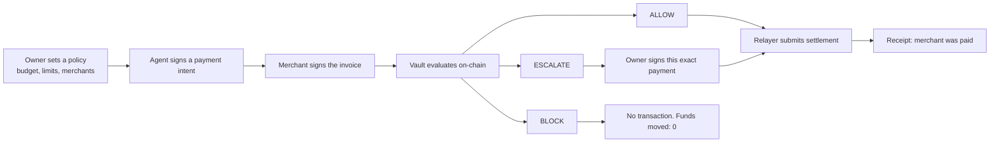
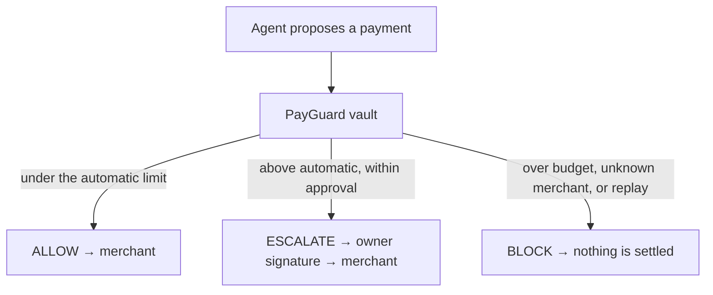
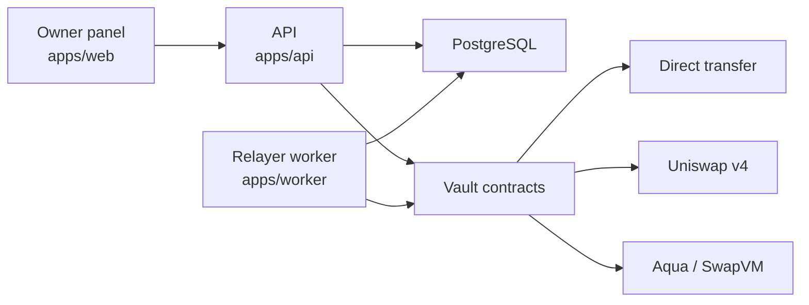

# PayGuard

**An on-chain spending firewall for AI agents.**

A person sets a budget and the merchants an agent may pay. The agent can propose a payment. It never holds the vault. Before any funds move, the vault decides one of three things:

| Decision | When | What happens |
| --- | --- | --- |
| **ALLOW** | Inside the automatic limit, to a permitted merchant | The relayer settles it. The owner is not asked to sign. |
| **ESCALATE** | Above the automatic limit, still inside the approval limit | The payment stops. The owner signs that one payment, then it can settle. |
| **BLOCK** | Over the budget, unknown merchant, or a replayed invoice | The vault refuses it. No transaction is sent and no funds move. |

The owner panel only shows what the API and the chain report. It never chooses ALLOW, ESCALATE, or BLOCK itself.

## Payment flow



ALLOW goes straight through. ESCALATE waits for one owner signature and does not change the merchant, amount, or route. BLOCK ends in the vault. A stopped relayer leaves an allowed payment queued; it is not marked paid until a receipt exists.

## Three lanes



Each route has its own vault and its own budget. Spending on one route does not reduce the others.

| Route | What the merchant receives |
| --- | --- |
| **Direct transfer** | The settlement token, paid from the vault |
| **Uniswap v4** | The invoiced output token. The vault spends its input token through the pool |
| **Aqua / SwapVM** | The invoiced output token, through the Aqua route |

## What you can do in the panel

Sign in with your wallet (SIWE). Then:

- **Overview** — remaining budget, the three limits, and the latest decision
- **Policies** — the rules stored on the vault: budget, automatic limit, approval limit, assets, route, and allowed merchants
- **Test payments** — scripted invoices through the same API, relayer, and vault as any payment
- **Approvals** — escalated payments waiting for your signature
- **Activity** — the policy decision and what actually happened on-chain, kept separate
- **Settings** — your account, local names, and whether the database, chain, relayer, and vault contracts are ready
- **Vault controls** — pause, resume, deposit, withdraw, replace a policy, or revoke one

Replacing a policy creates a new on-chain policy. Revoking one stops that policy from spending. The owner’s private key stays in the wallet. The API and the worker refuse to start if an owner key is placed in the environment.

## How the pieces fit



| Path | Role |
| --- | --- |
| `apps/web` | React 19 + Vite owner panel. Talks to `/v1` on the same origin. |
| `apps/api` | Fastify API. Sessions, policies, invoices, intents, approvals, and the demo bridge. |
| `apps/worker` | Submits queued settlements and records what the chain did, including a replaced policy. |
| `contracts/core-v4` | Vault, policy evaluation, and the Uniswap v4 adapter. |
| `contracts/aqua` | Aqua / SwapVM route. |
| `packages/` | Shared database, domain types, chain bindings, and integration code. |

## Run it locally

You need Node.js 24 or newer, pnpm 10.33.0, PostgreSQL 17, and [Foundry](https://book.getfoundry.sh/) (Anvil). Assets in the local demo are mock tokens on chain `31337`. No real funds move.

```bash
git clone https://github.com/kosuke-eth/PayGuard.git
cd PayGuard
corepack enable
corepack prepare pnpm@10.33.0 --activate
pnpm install

cp .env.example .env
cp apps/web/.env.example apps/web/.env
```

Create the local database role and databases (`payguard` / `payguard_local_dev`, databases `payguard_dev` and `payguard_test`), then:

```bash
pnpm --filter @payguard/db migrate
anvil
pnpm --filter @payguard/api exec tsx scripts/demo-setup.ts
```

`demo-setup` prints `PAYGUARD_DEPLOYMENT_ID`. Paste that value into `.env`, then start three processes:

```bash
pnpm --filter @payguard/api dev
pnpm --filter @payguard/worker dev
pnpm --filter @payguard/web dev
```

Open **http://localhost:5173** (not `127.0.0.1`). Import the Anvil owner account into your wallet and sign in. Step-by-step notes, including Windows, are in [docs/ENV_SETUP.md](docs/ENV_SETUP.md).

The first time you copy `.env.example`, `PAYGUARD_DEPLOYMENT_ID` is still a placeholder. The API will not serve a deployment until `demo-setup` has printed a real id and you have saved it.

## Try the three decisions

After sign-in, choose an **active** agent in the dropdown. On **Test payments**:

1. **Run Demo Compute** — a small invoice. Expected result: **ALLOW**, then a settlement receipt.
2. **Run Demo Hotel** — above the automatic limit and within the approval limit. Expected result: **ESCALATE**. Sign that card under **Approvals**. The merchant is paid only after that signature.
3. **Run Over Hard Budget** — above the total budget. Expected result: **BLOCK**. No transaction, and funds moved stay at 0.

A revoked policy cannot spend. Switch to an active route before starting a payment.
