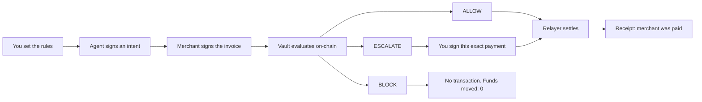
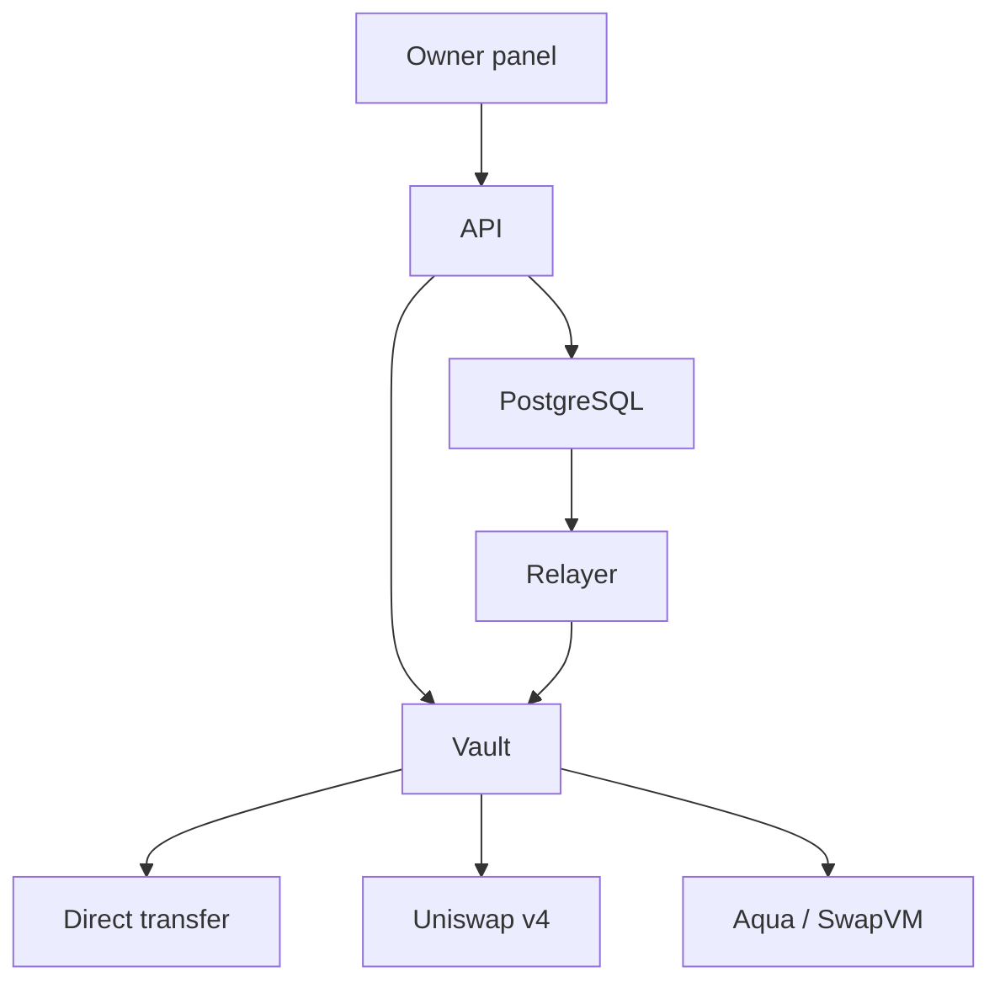

# PayGuard

An AI agent that can pay is an agent that can empty the account. **PayGuard is the vault in between.**

You set a budget, an automatic limit, and the merchants the agent may pay. The agent proposes a payment. It never holds the funds. The vault decides on-chain, before anything moves:

| | A small, allowed bill | A larger bill you did not pre-approve | Anything outside the rules |
| --- | --- | --- | --- |
| **Decision** | **ALLOW** | **ESCALATE** | **BLOCK** |
| **In the local demo** | 0.50 settles on its own | 180 waits for your signature | 500 never leaves the vault |
| **What you do** | Nothing | Sign that one payment | Nothing |
| **What the merchant gets** | The exact invoiced amount | The exact amount, only after you sign | Nothing. No transaction is sent |

The screen does not make this choice. It shows the decision the vault already made.

## One payment, from proposal to receipt



ALLOW goes straight through. ESCALATE pauses until you sign, and the signature cannot change the merchant, the amount, or the route. BLOCK ends inside the vault. If the relayer is down, an allowed payment stays queued. It is not marked paid until a receipt exists.

## Three budgets, not one shared wallet

The same agent can spend through more than one route. Each route is its own vault and its own budget. A payment on Uniswap v4 does not reduce the Direct or Aqua budget.

| Route | How the merchant is paid |
| --- | --- |
| **Direct transfer** | The settlement token moves straight from the vault |
| **Uniswap v4** | The vault spends its input token through the pool. The merchant receives the invoiced output |
| **Aqua / SwapVM** | Same shape as the swap route, through Aqua |

## What you see after you sign in

The panel is the owner’s view of one agent. You connect a wallet, then:

- **Overview** shows the remaining budget and the three limits.
- **Policies** reads the rules back from the vault.
- **Test payments** sends a scripted invoice through the real API, relayer, and vault.
- **Approvals** lists payments that escalated and are waiting for you.
- **Activity** separates the policy’s decision from what happened on-chain.
- **Vault controls** let you pause spending, move funds, replace a policy, or revoke one.

Your private key stays in the wallet. The API and the worker refuse to boot if an owner key is put in the environment.

## How it is built



| Piece | Where it lives |
| --- | --- |
| Owner panel | `apps/web` — React 19 and Vite. Calls `/v1` on the same origin. |
| API | `apps/api` — sessions, policies, invoices, intents, and approvals. |
| Relayer | `apps/worker` — submits queued settlements and records the chain, including a replaced policy. |
| Vault and Uniswap v4 | `contracts/core-v4` |
| Aqua / SwapVM | `contracts/aqua` |
| Shared libraries | `packages/` |

## Run the demo

Node.js 24+, pnpm 10.33.0, PostgreSQL 17, and [Foundry](https://book.getfoundry.sh/). The demo uses mock tokens on local chain `31337`. No real funds move.

```bash
git clone https://github.com/kosuke-eth/PayGuard.git
cd PayGuard
corepack enable
corepack prepare pnpm@10.33.0 --activate
pnpm install
cp .env.example .env
cp apps/web/.env.example apps/web/.env
```

Create the `payguard` database role, then:

```bash
pnpm --filter @payguard/db migrate
anvil
pnpm --filter @payguard/api exec tsx scripts/demo-setup.ts
```

Paste the printed `PAYGUARD_DEPLOYMENT_ID` into `.env`. Start the API, the relayer, and the panel:

```bash
pnpm --filter @payguard/api dev
pnpm --filter @payguard/worker dev
pnpm --filter @payguard/web dev
```

Open [http://localhost:5173](http://localhost:5173). Use that host, not `127.0.0.1`. Import the Anvil owner account into your wallet and sign in.

Full setup, including Windows, is in [docs/ENV_SETUP.md](docs/ENV_SETUP.md).

## See the three decisions yourself

Choose an **active** agent, open **Test payments**, and run these in order:

1. **Demo Compute** — ALLOW. A receipt appears, and the merchant is paid.
2. **Demo Hotel** — ESCALATE. Open **Approvals**, sign that card, and the same payment then settles.
3. **Over Hard Budget** — BLOCK. There is no transaction, and funds moved stay at 0.

If a policy says revoked, pick another route. A revoked vault will not spend.
