## 1. Entire PayGuard system

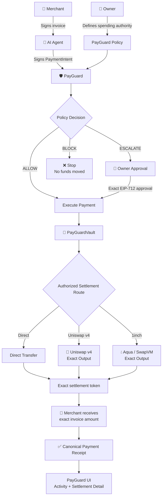

The main mental model is:

> **AI proposes → PayGuard authorizes → settlement protocol executes.**

Uniswap and Aqua **do not decide whether the agent is allowed to spend**. PayGuard does.

---

# 2. ALLOW vs ESCALATE vs BLOCK

This is the actual heart of the product.

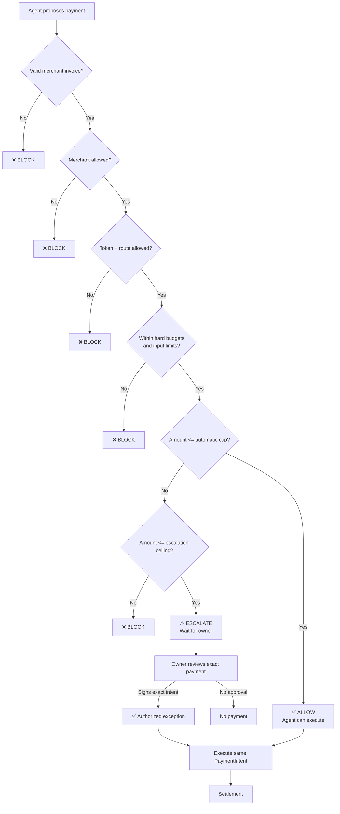

So with the demo policy:

```text
Total budget:          300 mUSDC
Automatic limit:       100 mUSDC
Approval ceiling:      200 mUSDC
```

you get:

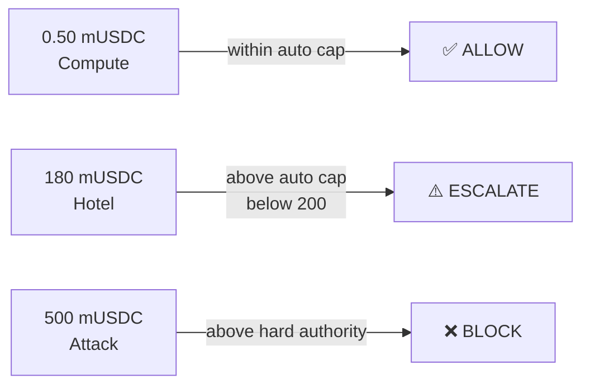

That is basically your entire hackathon story.

---

# 3. Who signs what?

This is especially important.

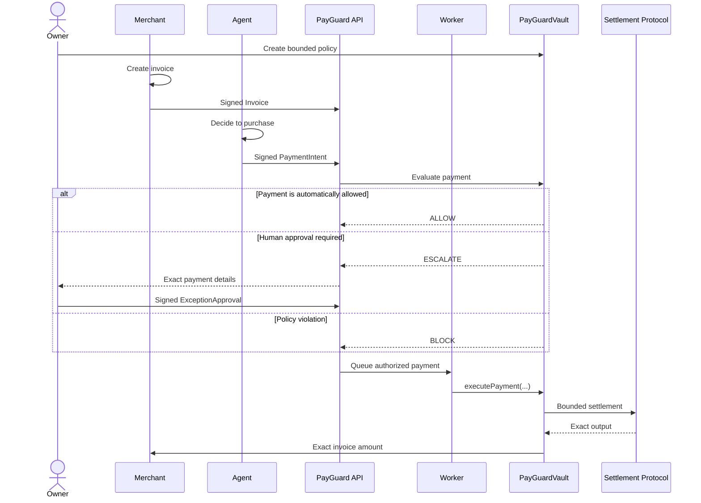

And the roles are:

```text
Merchant → signs Invoice

Agent → signs PaymentIntent

Owner → signs ExceptionApproval when necessary

Relayer/Worker → signs the blockchain transaction
                 but does NOT receive spending authority
```

That separation is intentional in the final architecture.

---

# 4. Uniswap v4 route

Suppose:

```text
Merchant wants: 0.50 mUSDC
Owner holds:    mRWA
```

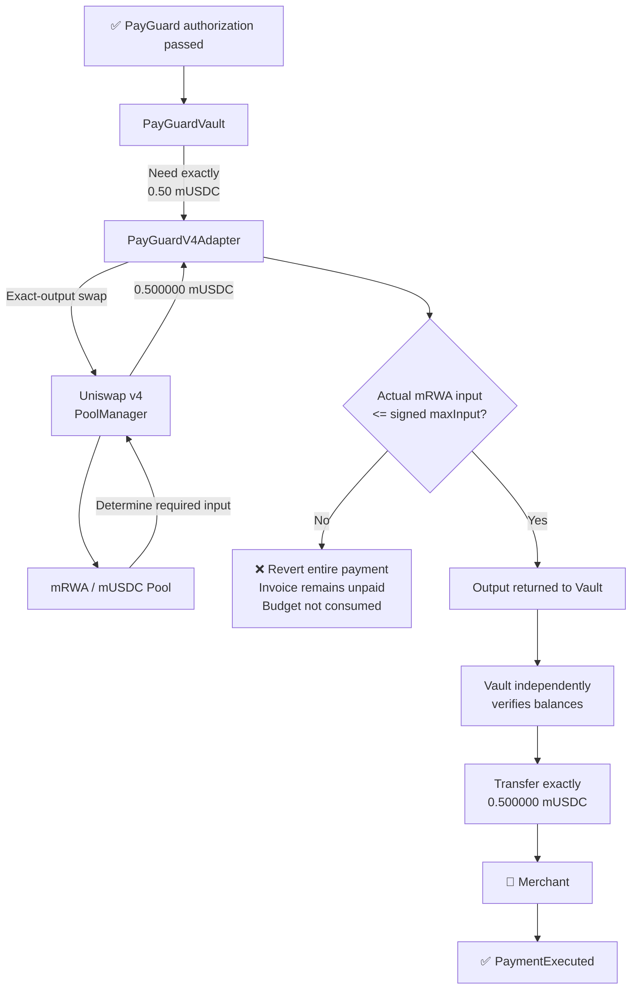

### Example

```text
Merchant requested       0.500000 mUSDC

Agent authorized max     0.00230 mRWA

Uniswap actually needs   0.00214 mRWA

✓ 0.00214 <= 0.00230

Merchant receives        0.500000 mUSDC
```

But:

```text
Uniswap needs            0.00260 mRWA

Agent authorized max     0.00230 mRWA

✗ exceeds limit
```

Then the **whole payment fails**.

That is the important integration: Uniswap liquidity **cannot enlarge the agent's authorization**. The plan requires the vault to verify the actual amount and exact merchant output.

---

# 5. Aqua / SwapVM route

The second route looks similar from PayGuard's perspective, but the settlement machinery is different.

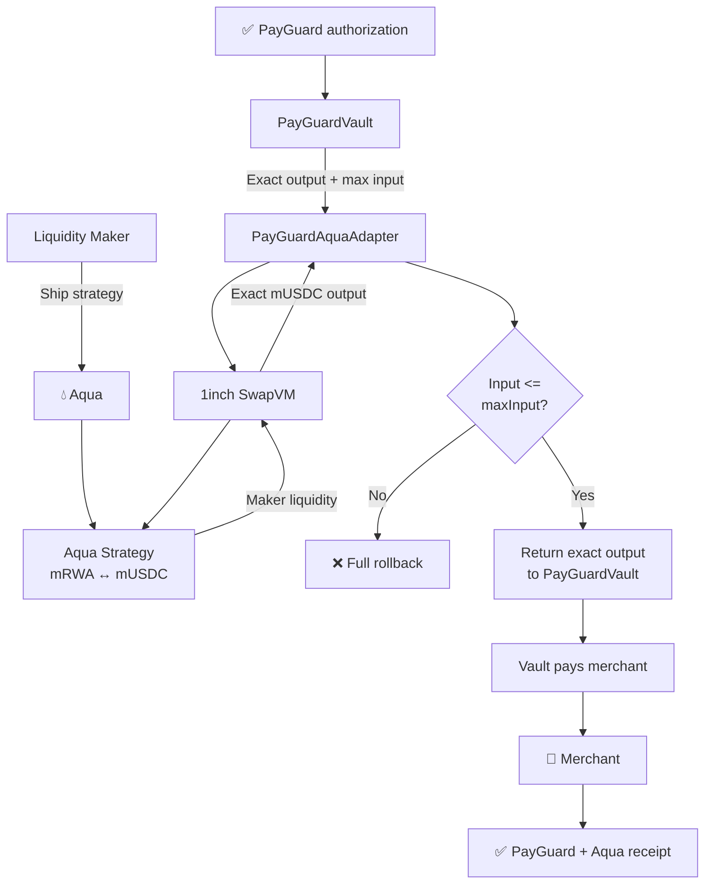

The Aqua integration is **not just calling a quote API**.

For the sponsor demo, we want to show:

```text
Strategy maker       0x...
Strategy hash        0x...
Strategy status      SHIPPED

Requested output     2.000000 mUSDC
Maximum input        0.0090 mRWA
Actual input         0.0081 mRWA

SwapVM execution     ✓
Aqua token movement  ✓
Merchant received    2.000000 mUSDC
```

The selected Aqua design uses a separate maker strategy, exact-output execution, a max-input threshold, and an independently authorized PayGuard route.

And this satisfies the direction of the 1inch track much better because official Aqua/SwapVM use and actual token transfers are part of its published requirements.

---

# 6. Uniswap and Aqua are parallel, not chained

This distinction is crucial.

### ❌ We are NOT doing this

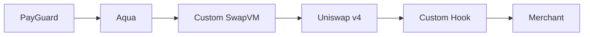

Too many dependencies.

---

### ✅ We are doing this

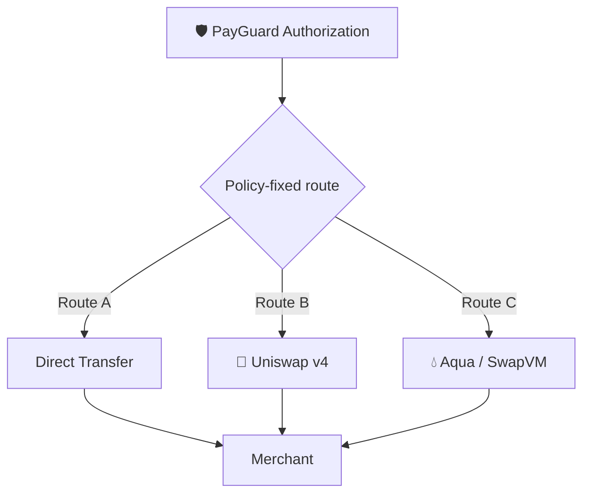

One payment uses **one** fixed route.

The final plan explicitly excludes serial Aqua → v4 composition.

---

# 7. Full technical flow from browser to blockchain

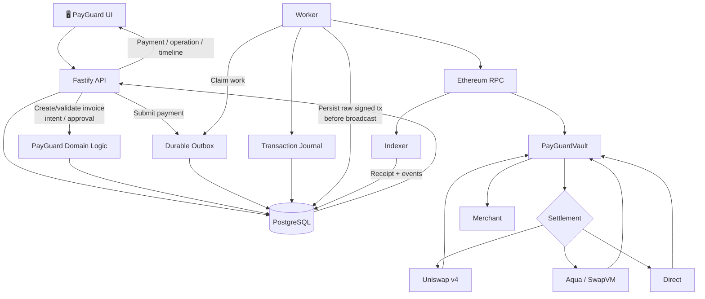

This is why a random returned transaction hash is **not** displayed as “Paid”.

The actual state is more like:

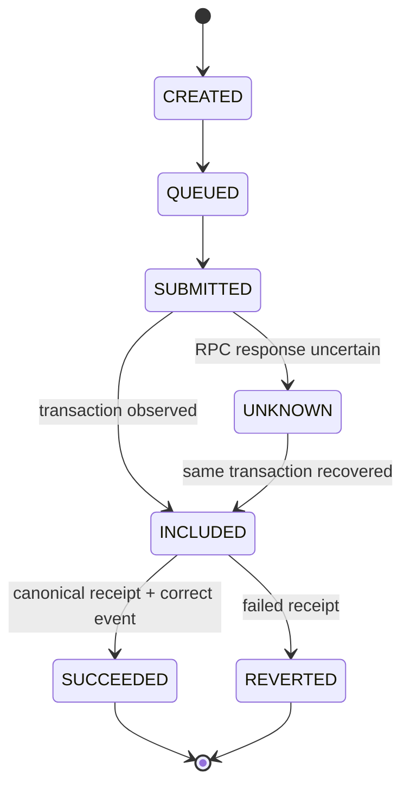

So:

```text
SUBMITTED ≠ paid
tx hash ≠ paid
API 202 ≠ paid

Canonical successful receipt
+
correct PayGuard event
=
paid
```

---

# 8. Browser/UI journey

This is the human-facing product.

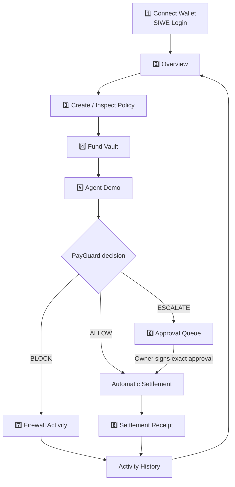

The final UI is intentionally product-looking without becoming seven independent products: overview, policy, approvals, activity, demo workspace, vault controls and receipt details.

---

# 9. The hackathon demo flow

This is probably the single most useful Mermaid diagram for your pitch.

```mermaid
flowchart LR
    A["👤 Show Policy<br/>300 total<br/>100 auto<br/>200 approval"]

    B["🤖 Compute invoice<br/>0.50 mUSDC"]

    C["✅ ALLOW"]

    D["🦄 Uniswap v4<br/>mRWA → mUSDC"]

    E["🏪 Merchant gets<br/>exactly 0.50"]

    F["😈 Attack invoice<br/>500 mUSDC"]

    G["❌ BLOCK<br/>0 funds moved"]

    H["🏨 Hotel invoice<br/>180 mUSDC"]

    I["⚠️ ESCALATE"]

    J["👤 Owner signs<br/>exact approval"]

    K["✅ Settlement"]

    L["💧 Aqua scenario<br/>different invoice"]

    M["✅ SwapVM + Aqua<br/>real token movement"]

    N["📜 Receipt<br/>real hashes + amounts"]

    A --> B --> C --> D --> E

    E --> F --> G

    G --> H --> I --> J --> K

    K --> L --> M --> N
```

That gives you:

**Autonomy → Firewall → Human control → Sponsor interoperability → Proof.**

Those are exactly the five ideas I would want a judge to remember after seeing PayGuard. The final plan's intended demonstration follows essentially this sequence.

## The simplest diagram to remember

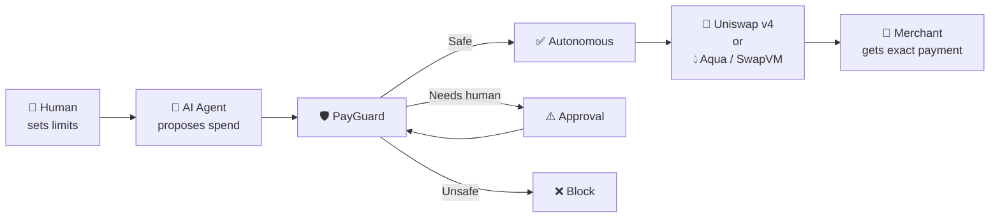
