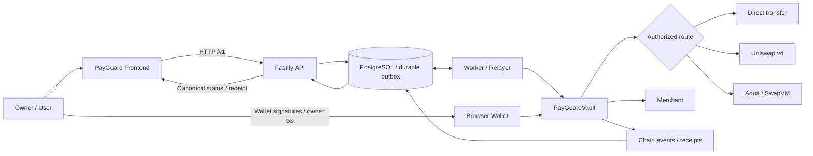
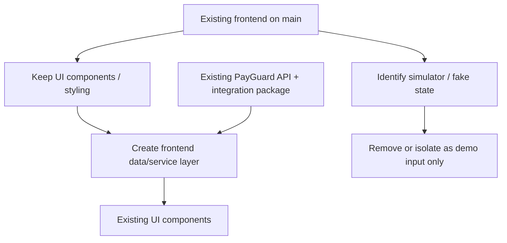
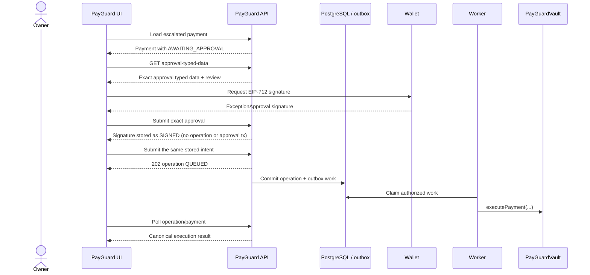
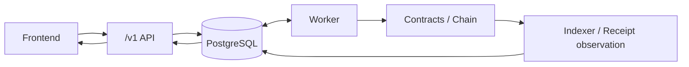
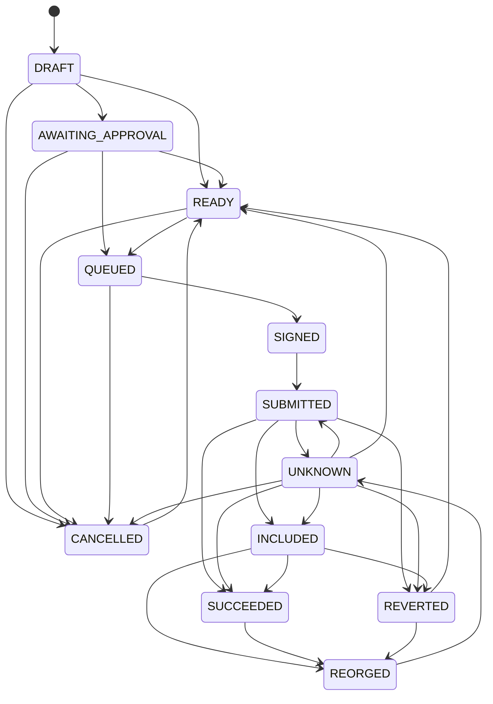
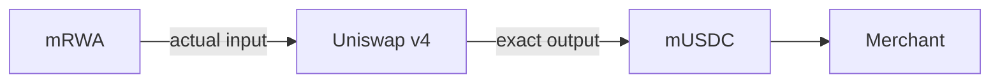
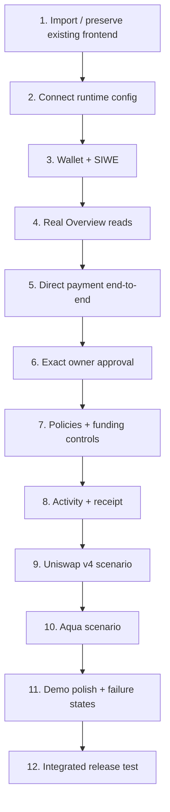
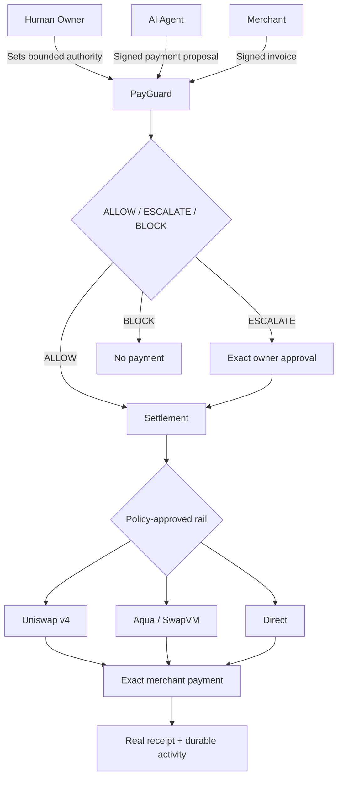

# PayGuard Frontend Product & Integration Plan

**Status:** Backend implementation complete; browser/frontend integration remains unproven  
**Audience:** Frontend owner / product engineer  
**Goal:** Build a polished hackathon-ready PayGuard frontend on top of the existing backend, contracts, database, worker, and sponsor settlement routes without rebuilding the backend or introducing a second source of truth.

---

## 1. Product in One Sentence

PayGuard is an **on-chain spending firewall for AI agents**: a human gives an agent bounded payment authority, small valid payments can execute automatically, larger valid payments require an exact owner approval, and invalid or out-of-policy payments are blocked.

> **Human sets the rules -> AI proposes a payment -> PayGuard decides ALLOW / ESCALATE / BLOCK -> authorized settlement executes -> UI shows real evidence.**

The backend and contract system are already implemented. The frontend should turn that system into a clear, trustworthy product.

---

## 2. Integration Boundary

The frontend should **not** implement payment authority, policy evaluation, database logic, transaction reconciliation, or blockchain truth locally.



### Source-of-truth rule

The frontend may **display** and **initiate** actions, but authoritative state comes from the backend and chain observations.

The frontend must never independently decide:

- whether a payment is ALLOW / ESCALATE / BLOCK;
- whether a payment succeeded;
- whether a merchant is permitted;
- whether a budget is available;
- how much input was actually spent;
- whether a transaction is canonical;
- whether an invoice has already been consumed.

---

## 3. Reuse the Existing Frontend

Do **not** rebuild the frontend from scratch unless a specific existing section is genuinely unusable.

Inspect the latest fetched and pinned `origin/main` frontend, then selectively import its useful presentation into an integration branch based on the preserved backend implementation. Do not base the integration on the simulator branch itself.

Preserve useful:

- layout;
- visual language;
- reusable components;
- navigation;
- typography;
- animation;
- cards;
- activity views;
- demo/scenario presentation.

The main integration task is to **replace the old simulated authority/data layer with the real backend**.



A small frontend service layer is preferable to rewriting every component around raw `fetch()` calls.

---

## 4. Frontend Architecture

A reasonable structure could look like this, but adapt it to the current frontend instead of forcing a rewrite:

```text
frontend/
|-- app/
|   |-- routes / screens
|   `-- app shell
|-- components/
|   |-- policy/
|   |-- payments/
|   |-- approvals/
|   |-- activity/
|   `-- demo/
|-- lib/
|   |-- payguard-client
|   |-- wallet
|   |-- amounts
|   |-- polling
|   `-- errors
|-- hooks/
`-- state/
```

Prefer the backend-facing integration package, generated schemas, ABI, typed-data definitions, status enums, and amount helpers where available.

Do **not** create a second handwritten copy of:

- contract structs;
- EIP-712 types;
- reason enums;
- ABI definitions;
- canonical payment statuses;
- base-unit amount rules.

---

## 5. Product Navigation

The final product should feel like a **real control panel for delegated AI spending**, not a blockchain explorer and not a developer console.

Recommended navigation:

```text
PayGuard

Overview
Policies
Approvals
Activity
Agent Demo

                         Wallet 0x12...98
                         Local / Demo Network
```

Keep deposit, withdraw, execution pause/unpause, and revocation controls in a **Vault controls** panel or drawer opened from Overview. Do not add a separate top-level Vault screen for the MVP.

A separate full merchant application is unnecessary. Merchant information can appear inside payment and receipt views.

---

## 6. Overview

This screen should explain the product in five seconds.

### Show

- connected owner;
- selected vault/policy profile;
- actual token balances;
- selected agent;
- active policy;
- total output budget;
- automatic payment cap;
- human escalation ceiling;
- remaining budget;
- pending approval count;
- recent activity;
- enabled settlement route.

Provide an explicit profile selector for the separate DIRECT, Uniswap v4, and Aqua vault/policy profiles created by the current demo provisioning. Selecting a profile changes the displayed vault, policy, balances, counters, budgets, and route together; do not aggregate them or treat the route as independently switchable.

Example:

```text
Travel Agent                          ACTIVE

Vault
1.20 mRWA
40.00 mUSDC

Spending Policy
Total budget             300 mUSDC
Autonomous payments      up to 100 mUSDC
Human approval           up to 200 mUSDC
Route                    Uniswap v4

Recent activity
0.50 mUSDC    ALLOW       SUCCEEDED
180 mUSDC     ESCALATE    AWAITING APPROVAL
500 mUSDC     BLOCK       NO SETTLEMENT
```

Do not invent a fiat portfolio value unless the backend provides a real valuation source.

---

## 7. Policies

This is the product's primary control surface.

### Primary fields

```text
Agent
Travel Agent

Total Budget
300 mUSDC

Automatic Payment Limit
100 mUSDC

Human Approval Up To
200 mUSDC

Allowed Categories
- Compute
- Hotels
- Transport

Allowed Merchants
- Demo Compute
- Demo Hotel

Input Asset
mRWA

Settlement Asset
mUSDC

Settlement Route
Uniswap v4
```

### Advanced section

Keep technical fields available but secondary:

- policy ID;
- agent address;
- input budget;
- maximum input per payment;
- route ID;
- adapter;
- validity window;
- merchant signer/recipient details when useful.

### Policy semantics

The contract uses immutable policy snapshots. Draft create/update is off-chain only; `/v1/policy-drafts/{id}/transaction` prepares an owner transaction that creates a new on-chain policy. Creating a policy for the same agent supersedes the prior active policy without editing its historical snapshot or inheriting its counters. Revocation similarly prepares an owner transaction and is not effective until that transaction executes and is observed.

---

## 8. Approval Queue

This should be one of the strongest screens.

Example:

```text
Approval Required

Demo Hotel
180.00 mUSDC

PayGuard decision
ESCALATE

Automatic limit
100 mUSDC

Maximum approved payment
200 mUSDC

Source asset
mRWA

Maximum input authorized
0.084 mRWA

Settlement route
Uniswap v4

Merchant receives exactly
180.00 mUSDC

Approval applies only to this exact payment.

[Not Now]                 [Approve & Sign]
```

### Approval flow



**Not Now** means no signature was produced. It should not be presented as an on-chain cancellation.

---

## 9. Activity / Firewall

This should feel like a **security log**, not merely a transaction list.

Recommended filters:

```text
ALL | ALLOWED | ESCALATED | BLOCKED
```

Clearly separate:

### Policy decision

- ALLOW
- ESCALATE
- BLOCK

from:

### Execution state

- DRAFT;
- AWAITING_APPROVAL;
- READY;
- QUEUED;
- SIGNED;
- SUBMITTED;
- UNKNOWN;
- INCLUDED;
- SUCCEEDED;
- REVERTED;
- CANCELLED;
- REORGED.

Example:

```text
09:41
Demo Compute
0.50 mUSDC

ALLOW
SUCCEEDED

Route: Uniswap v4
```

```text
09:43
Demo Hotel
180 mUSDC

ESCALATE
Awaiting owner approval
```

```text
09:45
Adversarial Payment
500 mUSDC

BLOCK
No settlement submitted
Funds moved: 0
```

Do not manufacture an on-chain block event for a preflight rejection.

---

## 10. Payment / Settlement Detail

This is where technical judges can verify the system is real.

### Human-readable view

```text
Payment Settled

Demo Compute
0.500000 mUSDC

Decision
ALLOW

Settlement

0.00214 mRWA
      |
      v
Uniswap v4
      |
      v
0.500000 mUSDC
      |
      v
Merchant

Merchant received
0.500000 mUSDC
```

### Technical drawer

Display backend-provided values such as:

- payment ID;
- invoice ID;
- intent hash;
- policy ID;
- route;
- settlement adapter;
- requested output;
- maximum authorized input;
- simulated/quoted input if available;
- actual input;
- transaction hash;
- block number;
- execution status;
- confidence;
- reconciliation;
- canonical observation.

Never collapse these into one value:

```text
requested output
maximum input
estimated input
actual input
```

They have different meanings.

---

## 11. Agent Demo Workspace

Keep the existing theatrical/demo presentation where useful.

Its job is to **initiate and visualize real scenarios**, not simulate blockchain authority.

Suggested actions:

```text
[ Run Safe Payment ]

[ Run Approval Scenario ]

[ Run Adversarial Payment ]

[ Run Aqua Payment ]
```

Example progression:

```text
Invoice created
      |
      v
Merchant signature verified
      |
      v
Agent intent signed
      |
      v
PayGuard evaluation
      |
      v
ALLOW
      |
      v
Settlement submitted
      |
      v
Transaction included
      |
      v
Merchant received 0.500000 mUSDC
```

Every authoritative step shown as completed must correspond to actual backend or chain evidence.

A deterministic demo scenario is acceptable. It should be presented as a controlled demo scenario, not fabricated live AI reasoning.

---

## 12. Database Integration

The frontend should integrate against the backend's public contract rather than directly reading PostgreSQL.



### Rule

**Frontend -> database direct access should not exist.**

PostgreSQL is an internal backend implementation detail. The frontend gets durable payment state through the API.

---

## 13. API Integration Areas

Use the current generated OpenAPI artifact for the implemented route/method inventory, `docs/API_CONTRACT.md` plus implemented response schemas for response shapes, and `@payguard/integration` for its published request schemas, enums, EIP-712 definitions, vault ABI, public-config schema, and helpers. The generated OpenAPI currently records request/parameter schemas but only generic success/error response envelopes; it is not a complete generated response model.

| Area | Frontend need |
|---|---|
| Runtime | network, deployments, enabled routes, supported assets |
| Authentication | challenge, wallet sign-in, session/logout |
| Vault | balances, owner state, funding/withdrawal actions |
| Policy | active policy, policy details, create/replace/revoke workflow |
| Invoice | demo invoice / merchant-authenticated invoice resource |
| Payment intent | create intent, evaluate/simulate, submit |
| Approval | obtain exact typed data, submit owner signature |
| Operation | poll asynchronous backend work |
| Payment | canonical payment state and actual settlement |
| Timeline | durable lifecycle history |
| Transaction | transaction/receipt evidence where exposed |

Do not hardcode endpoint behavior from this document if generated OpenAPI or the backend integration package differs. The actual backend contract wins.

`createPayGuardClient()` is intentionally thin: it currently has named wrappers only for config, auth challenge/verify, invoice creation, intent creation, payment read, and the three demo routes. Use its generic `callPayGuardApi()` for the other implemented `/v1` routes rather than assuming a named wrapper exists.

Known current backend mismatch: `demo-setup.ts` stores the Uniswap route kind as `V4`, while `PublicConfig` / `PUBLIC_CONFIG_SCHEMA` declare `UNISWAP_V4`. Reconcile that backend/config artifact before schema-valid frontend bootstrap; do not hide it with a frontend-only alias.

---

## 14. Application Bootstrap

```mermaid
sequenceDiagram
    participant UI
    participant API
    participant Wallet

    UI->>API: Load runtime configuration
    API-->>UI: chain + deployment + capabilities

    UI->>Wallet: Detect connected account/network
    UI->>API: Recover /v1/auth/session with session cookie

    alt Existing authenticated session is valid
        API-->>UI: wallet + expiry + rotated CSRF token
        UI->>API: Load owner resources
    else No valid session; owner chooses Connect
        UI->>API: Request SIWE challenge
        API-->>UI: SIWE message
        UI->>Wallet: Sign message
        Wallet-->>UI: Signature
        UI->>API: Verify
        API-->>UI: Authenticated session
    end
```

The application should fail clearly if `/v1/config` is unavailable or reports an unexpected chain/deployment/schema version, or if the wallet is connected to the wrong network. `/health/ready` is an operator probe, not a browser session/config response.

---

## 15. Wallet Responsibilities

The browser wallet belongs to the **human owner**.

It may be used for:

- SIWE authentication;
- vault deposit/withdraw actions;
- policy owner transactions;
- revocation/pause actions;
- exact exception approval signatures.

It should **not** contain or impersonate:

- the demo merchant key;
- the agent key;
- the worker/relayer key.

Those are separate roles.

The merchant signs the invoice, the agent signs the payment intent, the owner signs SIWE/owner transactions/exact exception approvals, and the relayer signs only the outer execution transaction. The API verifies and stores these artifacts; it does not sign for any of those actors.

---

## 16. Amount Safety

Never use JavaScript `Number` as the authoritative representation for:

- token atomic amounts;
- uint256 values;
- chain nonces;
- large IDs.

Use the backend/integration package's decimal-string / bigint helpers.

Formatting happens only at the display boundary.

```text
Backend
"500000" atomic mUSDC units

      |
      v
safe formatter

      |
      v

Frontend
0.500000 mUSDC
```

---

## 17. Polling and Payment Truth

Many operations are asynchronous.

A response saying an operation was accepted does **not** mean the merchant has been paid.



These are payment execution states. Operation polling is a separate axis with `QUEUED`, `IN_PROGRESS`, `COMPLETED`, `UNKNOWN`, and `FAILED`; the exact names should come from shared schemas.

The UI should treat canonical receipt plus expected PayGuard execution evidence as success, not merely:

- HTTP `202`;
- a returned transaction hash;
- a frontend animation;
- a quote;
- an in-memory state update.

---

## 18. Error UX

Errors should be translated into useful product language without hiding the backend reason.

Examples:

```text
POLICY ERROR
Payment blocked because it exceeds the allowed escalation ceiling.
```

```text
WALLET ERROR
Your wallet changed accounts. Review the payment again before signing.
```

```text
NETWORK ERROR
PayGuard cannot confirm whether the transaction was included yet.
Status: UNKNOWN
```

```text
SETTLEMENT ERROR
The swap could not satisfy the requested output within the authorized input limit.
No PayGuard payment was completed.
```

Unknown infrastructure state must not be displayed as BLOCK.

---

## 19. Uniswap v4 Experience



The receipt should show:

```text
Requested output       0.500000 mUSDC
Maximum input          0.00230 mRWA
Actual input           0.00214 mRWA
Merchant received      0.500000 mUSDC
Route                   Uniswap v4
```

Do not imply zero fees or merchant subsidy unless that feature is actually enabled and evidenced by the backend.

---

## 20. Aqua / SwapVM Experience

Aqua is an independent PayGuard settlement route.

Suggested technical receipt information:

```text
Route                  Aqua / SwapVM
Route ID               0x...
Adapter                0x...
Requested output       2.000000 AQOUT
Maximum input          0.0090 AQIN
Actual input           0.0081 AQIN
Merchant received      2.000000 AQOUT
```

The current public config/payment read models expose the Aqua route ID, adapter, token pair, and settlement amounts, but not the pinned maker or strategy hash. Do not invent those fields from fixture logs. The frontend does not need to expose all Aqua internals in the normal payment flow; a collapsible technical section is enough.

Uniswap v4 and Aqua are proven through the direct payment-intents API/worker/vault path. Their use through `/v1/demo/runs` is architecturally available but not yet tested; keep that distinction until frontend/browser integration proves it.

---

## 21. Demo Narrative

The frontend should support a clear 3-4 minute product demo and a much shorter fallback demo.

### Scene 1 - Authority

Show:

```text
Agent budget         300 mUSDC
Automatic limit      100 mUSDC
Approval ceiling     200 mUSDC
```

Message:

> The agent receives bounded spending authority, not unrestricted control of a wallet.

### Scene 2 - Autonomous payment

```text
Demo Compute
0.50 mUSDC
```

Result:

```text
ALLOW
-> Uniswap v4
-> exact merchant payment
```

Open receipt briefly.

### Scene 3 - Attack

```text
Adversarial payment
500 mUSDC
```

Result:

```text
BLOCK
No settlement submitted
Funds moved: 0
```

### Scene 4 - Human approval

```text
Demo Hotel
180 mUSDC
```

Result:

```text
ESCALATE
-> owner signs exact approval
-> settlement succeeds
```

### Scene 5 - Second settlement rail

Run a separate Aqua-backed invoice.

```text
ALLOW
-> Aqua / SwapVM
-> exact merchant payment
```

### Scene 6 - Evidence

Open Activity / Receipt and show real decision, route, input/output, transaction, and canonical status.

---

## 22. Branch / Collaboration Plan

The backend is implemented and `backend/contract` is currently pushed. Recheck branch/HEAD/upstream before starting integration.

Recommended frontend workflow:

1. verify and preserve the exact backend commit/worktree that frontend integration targets;
2. fetch and pin the latest `origin/main` SHA without merging or checking it out over the backend;
3. inspect that commit separately and record what changed since the earlier frontend audit;
4. create the integration branch from the preserved backend implementation;
5. selectively import useful frontend presentation and provenance from `origin/main`;
6. integrate against the backend public API/integration package;
7. avoid merging old simulator backend/contracts into the real backend;
8. keep frontend-specific changes isolated until the first end-to-end path works;
9. merge through normal review once both sides agree on the runtime contract.

If frontend and backend currently live on divergent branches, prefer a dedicated integration branch rather than rewriting either history.

### Do not blindly resolve conflicts in

- root `package.json`;
- lockfiles;
- workspace configuration;
- `.env.example`;
- build scripts;
- ABI/generated files.

Inspect and reconcile them deliberately.

---

## 23. Environment Contract

The backend owns the runtime environment.

Frontend should need only browser-safe values, ideally obtained from:

1. backend runtime config endpoint; or
2. frontend build-time public variables where unavoidable.

Do not expose:

- database credentials;
- relayer private key;
- demo actor private keys;
- auth/session secrets;
- backend-only RPC credentials where they need to remain private.

Prefer backend runtime configuration for dynamic deployment data rather than duplicating contract addresses manually.

Backend setup is documented in:

```text
docs/ENV_SETUP.md
```

---

## 24. Recommended Implementation Order



Do not wait for every visual screen to be complete before proving the first end-to-end payment.

The first major frontend milestone should be:

> **Connect wallet -> authenticated owner -> real payment request -> real PayGuard result -> real receipt displayed after reload.**

Once that works, expand the product surface.

---

## 25. Flexible Design Guidance

The frontend owner should have freedom over:

- component library;
- exact layout;
- animation style;
- spacing;
- responsive behavior;
- typography;
- navigation details;
- card structure;
- visualization of payment routes;
- page transitions;
- whether detail surfaces are pages, modals, or drawers.

The implementation should optimize for:

### Clarity

A judge should understand ALLOW / ESCALATE / BLOCK immediately.

### Trust

Every payment claim should be backed by actual backend/chain state.

### Speed

The live demo should have very few clicks.

### Technical depth on demand

Normal users see simple language; technical details live one click deeper.

### Visual continuity

Reuse the existing frontend's strongest design ideas rather than producing a visibly separate application.

---

## 26. Non-Goals

Do not expand the frontend into:

- a general blockchain explorer;
- a PostgreSQL admin interface;
- an indexer/reorg dashboard;
- a user-management platform;
- a complete merchant SaaS suite;
- arbitrary router configuration;
- arbitrary contract calls;
- multi-chain route optimization;
- an Aqua + Uniswap chained settlement flow;
- a replacement policy engine;
- a second payment backend.

---

## 27. Frontend Definition of Done

The frontend is ready when all of the following work against the completed backend.

### Authentication

- owner can connect a wallet;
- SIWE succeeds;
- account/network changes are handled safely.

### Vault

- real vault balances load;
- supported owner actions work or are surfaced through the existing prepared-transaction flow.

### Policy

- real active policy loads;
- replacement/create/revoke actions used by the MVP work;
- limits and route are displayed correctly.

### ALLOW

- a real valid invoice/intent can be submitted;
- the UI shows ALLOW from the backend;
- settlement executes;
- actual merchant output is displayed.

### ESCALATE

- an escalated payment appears in Approvals;
- wallet receives exact typed data;
- owner signature is submitted;
- the same payment progresses to real settlement.

### BLOCK

- an invalid/out-of-policy request shows the actual backend reason;
- the UI does not fabricate a transaction;
- no successful payment is displayed.

### Uniswap

- a real PayGuard-authorized v4 payment is visible end-to-end.

### Aqua

- a separate real Aqua/SwapVM payment is visible end-to-end.

### Durability

- page reload does not lose authoritative payment state;
- queued/submitted/unknown states are represented correctly;
- the UI never treats a transaction hash alone as final success.

### Demo

- main demo scenarios run quickly from a known seeded environment;
- receipts contain real execution evidence;
- disabled features are not advertised as working.

---

## 28. Backend <-> Frontend Handoff Checklist

Before final integration, both sides should agree on:

```text
[ ] backend commit / release being integrated
[ ] local/runtime backend URL
[ ] browser origin
[ ] chain ID
[ ] runtime config endpoint
[ ] generated OpenAPI/schema version
[ ] integration package version/workspace state
[ ] ABI version
[ ] demo owner account
[ ] demo agent profile(s)
[ ] demo merchants/invoices
[ ] enabled routes
[ ] reset/seed procedure
[ ] direct scenario
[ ] Uniswap scenario
[ ] Aqua scenario
[ ] approval scenario
[ ] blocked scenario
```

Any mismatch here should be fixed at the integration boundary rather than hidden with frontend constants.

---

## 29. Final Product Shape



The frontend succeeds if it makes this feel simple:

> **The AI can act autonomously inside rules set by a human, while PayGuard prevents the agent and the settlement route from spending beyond those rules.**

That is the product story. Everything in the UI should reinforce it.
